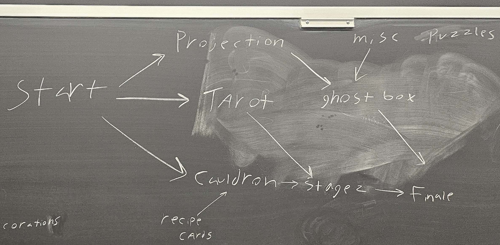
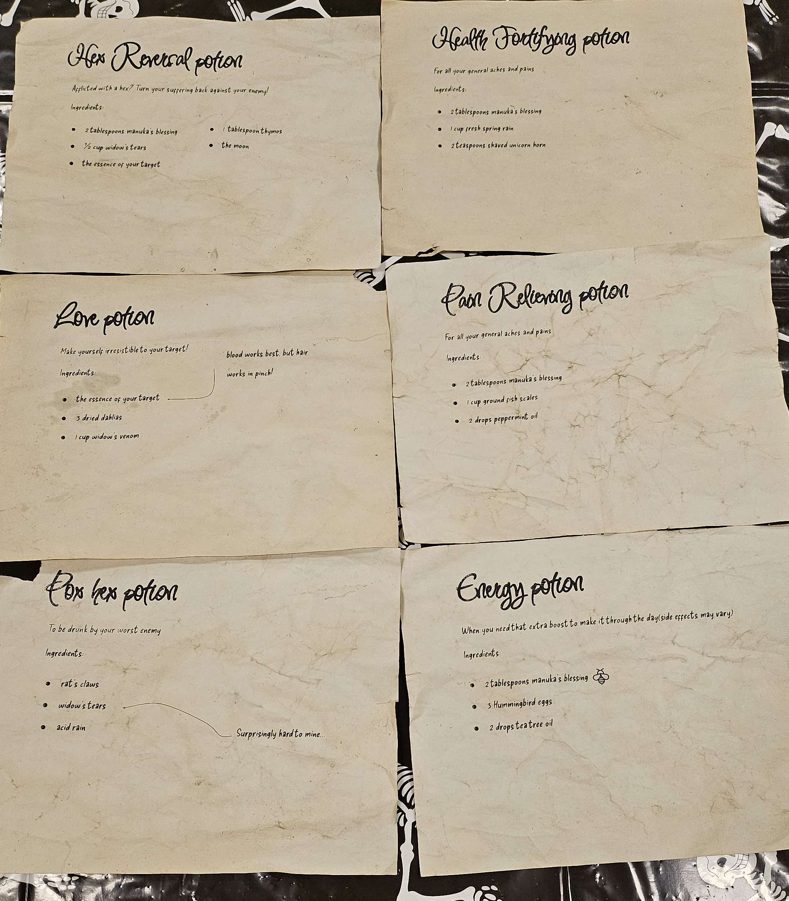
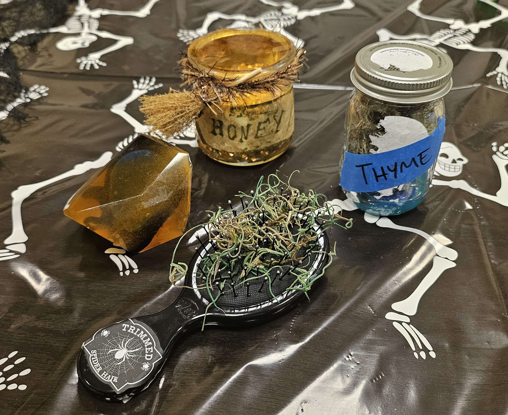
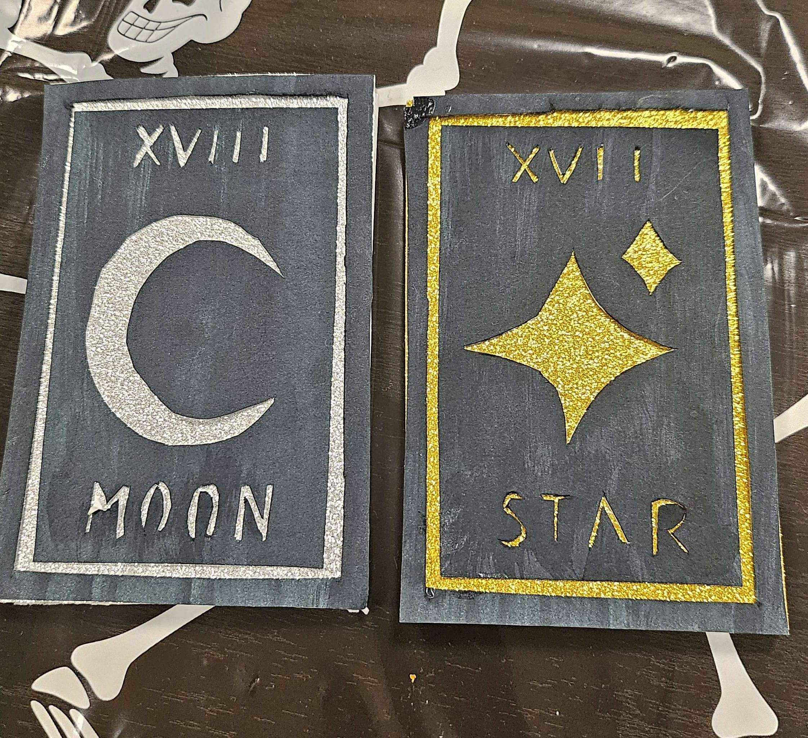
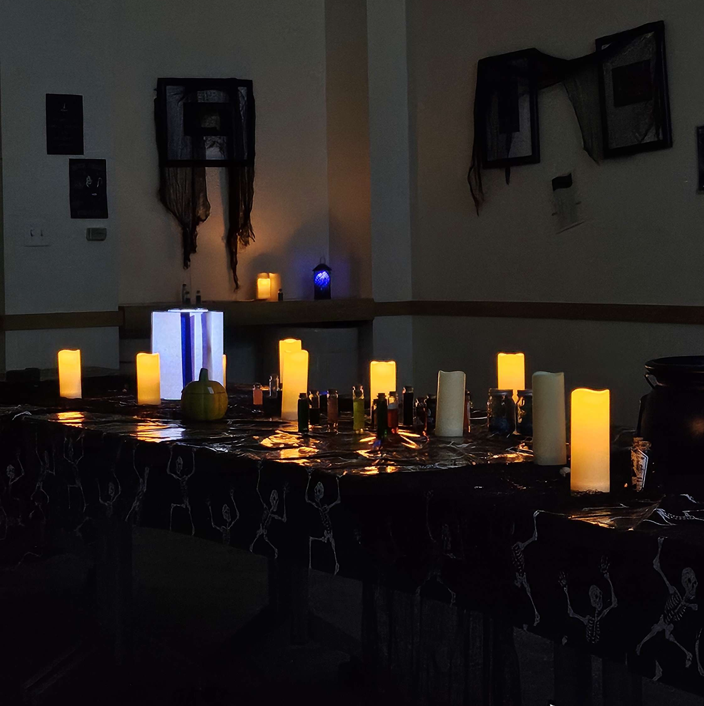
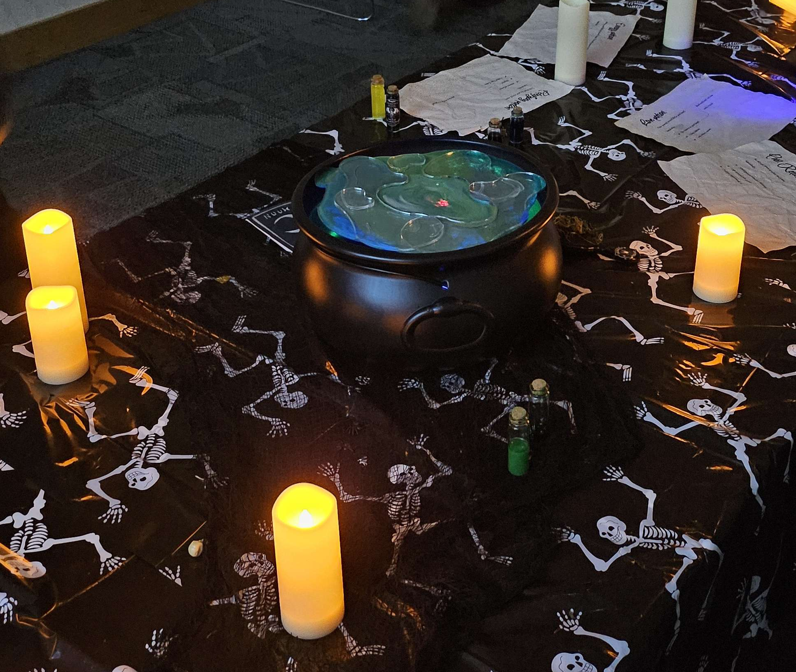
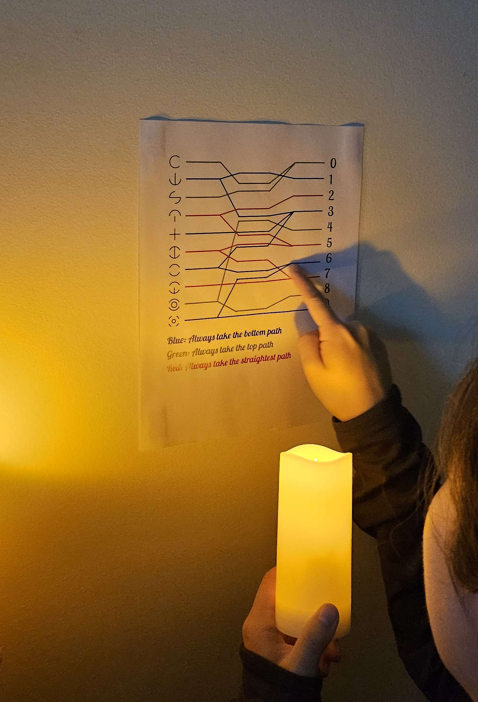
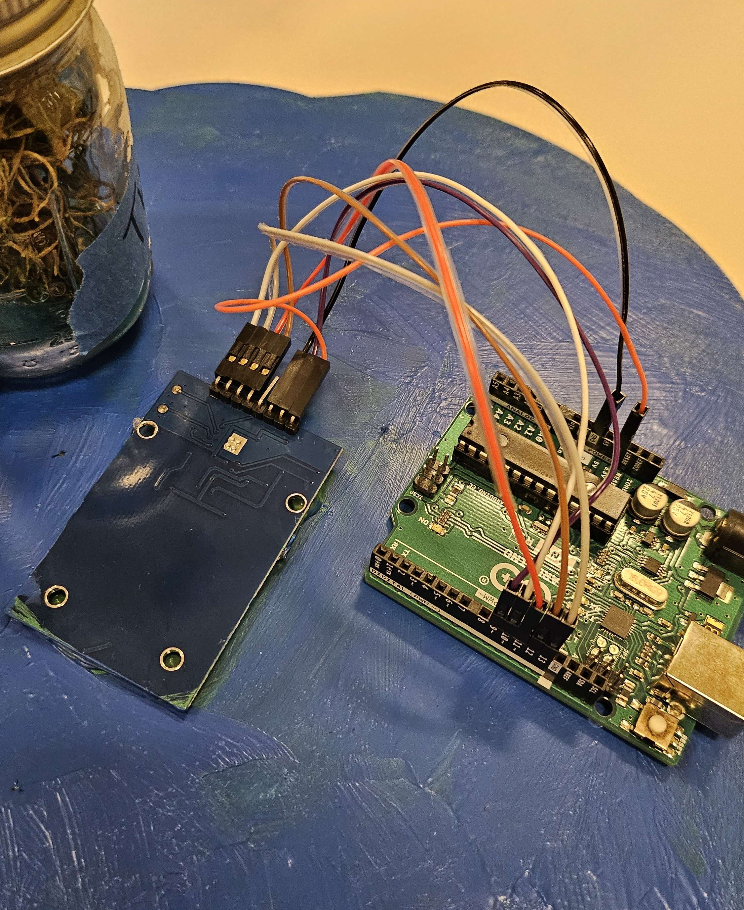

# Halloween Escape Room
A Halloween-themed weekend-long escape room created for Halloween 2025.

## Overview
This project contains the Unity experience behind our escape room, integrating individual physical puzzles into a larger branching narrative. It was developed in Unity by members of CMU's Theme Park Engineering Group. 

## Features
- Finite State Machine to control game state based on Arduino inputs
- UI and audio effects
- Serial communication with an Arduino RFID reciever
- 5 RFID-powered interactive props

## System Design
Much of this system is inspired by a previous TPEG project, [Our 2025 Spring Carnival Booth Game](https://github.com/p0nk0/DinoGame). The RFID-scanning arduino code is the same as [the Arduino code](https://github.com/p0nk0/DinoGame) from that project. 

In order for guests to complete the room, they need to scan 5 objects using the cauldron to create a Hex Reversal Potion. 4 of these objects are hidden around the room, and must be discovered via the recipe cards. The final object is trapped inside of box, with the combination for it coming from the projection puzzle (which in turn has a few objects hidden around the room. 

These are the recipe cards from the room:

These are the 5 RFID-enabled props (Only the moon tarot card contains an RFID tag):

## Setup
- Use unity 6000.0.40f1
- Make sure the Cauldron's COM port and baud rate match the SerialController object
- To add/remove potion ingredients, edit validProps in GameStateManger.cs
- Press play!

## Media

## Credits
Unity Project
- Jacob Yakubisin: Arduino setup and testing
- Madhav Anugopal: Audio effects and narrative design
Escape Room Team Leads
- Theming: Carolyn Burback, Alva Huang
- Pepper's Ghost Puzzle: Tay Padilla
- Projection Puzzle: Jacob Yakubisin
- Misc. Puzzles: Mia Evans
- Props: Carolyn Burback, Autumn Chan
- Recipe Cards: Courtney Singleton
